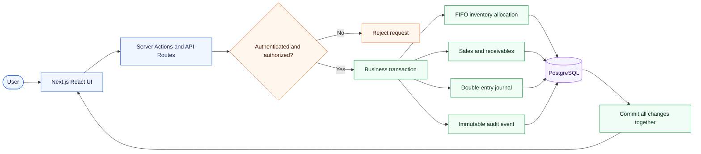

<div align="center">
  
  <h1>GramFlow</h1>
  <p><strong>Inventory, receivables, and accounting—kept in one reliable flow.</strong></p>
  <p>A production-oriented business management app built with Next.js, TypeScript, and PostgreSQL.</p>

  <p>
    
    
    
    
    <a href="https://github.com/kashnordeen/GramFlow/actions/workflows/ci.yml"></a>
  </p>
</div>

---

GramFlow manages stock batches, FIFO sales, customer receivables, payments, accounting journals, user access, and audit history. PostgreSQL is the only runtime database, and all sensitive business operations are enforced on the server.

### Highlights

| Capability | What it provides |
| --- | --- |
| 📦 **Concurrency-safe FIFO** | Locks and consumes the oldest eligible stock without overselling. |
| 🧾 **Sales and receivables** | Tracks payments, outstanding balances, batch lineage, and reversals. |
| ⚖️ **Double-entry accounting** | Produces balanced, immutable journal entries for financial events. |
| 🔐 **Authentication and RBAC** | Enforces persisted roles and permissions on every protected operation. |
| 🛡️ **Immutable audit history** | Records important changes in the same transaction as the business event. |
| 🧪 **Release verification** | Runs migrations, integration tests, builds, and security audits in CI. |

**Navigate:** [Quick start](#quick-start) · [Architecture](#architecture) · [Demo data](#demonstration-data) · [Data migration](#sqlite-data-migration) · [Security](#rbac-and-authentication) · [Verification](#verification)

## Architecture



The flow is deliberately simple:

1. The browser calls a server action or API route; it never connects directly to PostgreSQL.
2. Authentication and RBAC are checked before the business transaction begins.
3. Inventory, receivables, accounting, and audit changes commit together—or all roll back together.

For a sale, the transaction locks inventory rows, assigns the oldest stock first, records batch lineage, updates the customer balance, posts balanced journals, and writes the audit event before committing once.

## Quick start

Requirements: Node.js 24 LTS and PostgreSQL 15+. Node 24 is required by the built-in SQLite importer. Docker is optional.

Install dependencies and create the local environment file in Windows PowerShell:

```powershell
npm install
Copy-Item .env.example .env
```

Choose one PostgreSQL setup:

- **Local PostgreSQL / pgAdmin:** create a login role named `gramflow` (login enabled, not a superuser), then create databases named `gramflow` and `gramflow_test`, both owned by `gramflow`.
- **Docker:** run `docker compose up -d`; the Compose service creates the development database at `localhost:5432`.
- **External PostgreSQL:** create equivalent application and disposable test databases and use their connection strings.

Configure `.env`, then initialize and start the application:

```powershell
npm run db:setup
npm run dev
```

Open `http://localhost:3000`. The application has no provider-specific database code.

Important environment variables:

- `DATABASE_URL`: PostgreSQL connection string (required)
- `TEST_DATABASE_URL`: disposable PostgreSQL database used by integration tests
- `DATABASE_SSL`: set `true` when the host requires TLS
- `DB_POOL_MAX`: maximum pooled connections (default 10)
- `JWT_SECRET`: random value of at least 32 characters (required)
- `REGISTRATION_CODE`: private initial-registration code
- `ALLOWED_EMAIL_DOMAIN`: organization email domain accepted by authentication
- `GOOGLE_CLIENT_ID`, `GOOGLE_CLIENT_SECRET`, `GOOGLE_REDIRECT_URI`: optional Google OAuth web-client credentials and exact callback URL
- `SEED_ADMIN_*`: optional development administrator credentials used by the seed script
- `DEMO_SEED_PASSWORD`: shared local-only password used by the optional demo fixtures

Never commit `.env`; `.env.example` contains placeholders only.

### First administrator login

The PostgreSQL username and password are database credentials, not GramFlow login credentials. On a new installation, open `http://localhost:3000/signup` and create the first application account using:

- an address under `ALLOWED_EMAIL_DOMAIN`
- a password of at least 10 characters containing uppercase, lowercase, and numeric characters
- the private `REGISTRATION_CODE` from `.env`

The first account receives the `ADMIN` role and is signed in automatically. Public signup closes after that account is created; administrators create subsequent users from `/admin/roles`.

### Google sign-in and first-admin signup

Create a Google OAuth **Web application** client, allow your app's origin, and register the exact redirect URI `http://localhost:3000/api/auth/google/callback` for local development (use your HTTPS origin in production). Set `GOOGLE_CLIENT_ID`, `GOOGLE_CLIENT_SECRET`, and `GOOGLE_REDIRECT_URI` in `.env`, then run `npm run db:migrate`. Google signup still requires `REGISTRATION_CODE` and is available only for the first administrator. After bootstrap, Google sign-in works only for an existing active account under `ALLOWED_EMAIL_DOMAIN`; it never self-registers a new teammate. For a custom domain, the Google ID token must include the matching Workspace hosted-domain claim. Without OAuth credentials, the button reports that configuration is required rather than pretending to sign in.

## Migrations and seed data

```bash
npm run db:migrate
npm run db:seed
# or both
npm run db:setup
```

Migrations in `db/migrations` run in filename order. The runner stores a SHA-256 checksum in `schema_migrations`, refuses to run if an applied migration changed, and wraps every new migration in a transaction. Seed data is idempotent and creates roles, permissions, the chart of accounts, and (only when configured) a development admin.

### Demonstration data

For a disposable local database only, configure `DEMO_SEED_PASSWORD` and run:

```bash
npm run db:seed:demo
```

This idempotently creates administrator, manager, inventory-operator, and accountant accounts under `ALLOWED_EMAIL_DOMAIN`, three sample customers, FIFO stock, a credit sale, payment, accounting journals, and audit events. It never runs as part of normal production setup.

See [`DEMO.md`](DEMO.md) for the five-minute demonstration walkthrough.

## SQLite data migration

The importer is non-destructive and reads the old SQLite database in read-only mode using Node's built-in SQLite API.

1. Back up the SQLite files, including any `-wal` file, and stop the old application.
2. Configure `DATABASE_URL` and run `npm run db:setup`.
3. Set `SQLITE_PATH` to the source file.
4. Run `npm run db:import-sqlite`.
5. Review the printed source/target row counts and start GramFlow against PostgreSQL.

The importer preserves IDs, loads tables in foreign-key order, advances identity sequences, validates row counts, checks key relationships, and never modifies or deletes the SQLite source. Run it against a fresh target database; `ON CONFLICT DO NOTHING` makes a retry safe but is not a merge strategy.

## Database schema

- Business: `users`, `customers`, `stock_batches`, `sales`, `sale_batch_assignments`, `payments`, `settings`
- RBAC: `roles`, `permissions`, `user_roles`, `role_permissions`
- Accounting: `accounts`, `journal_entries`, `journal_lines`
- Compliance: `audit_logs`

Most money values use `NUMERIC(14,2)`; total batch cost uses `NUMERIC(18,2)`, FIFO unit cost uses `NUMERIC(18,6)`, and quantities use `NUMERIC(14,3)`. Foreign keys, uniqueness, non-negative checks, sale arithmetic checks, partial FIFO indexes, and frequently used relationship/timestamp indexes are enforced in PostgreSQL.

## FIFO and concurrency

Eligible batches are selected by `created_at, id` and locked with `SELECT … FOR UPDATE`. Allocation may consume part of a batch and continue through later batches. Updates include a non-negative guard. The sale uses a serializable transaction; concurrent requests cannot consume the same available quantity. Any insufficient-stock, accounting, or audit failure rolls the entire sale back.

Stock receipts record the cost of the whole batch. FIFO derives the per-gram cost internally for each sale allocation; batch revenue uses the final selling amount after discounts, and realized profit excludes unsold stock and reversed sales.

`sale_batch_assignments` stores the exact quantity and historical unit cost from every consumed batch. Reversals restore those exact batches and retain the original sale and allocation records.

## Double-entry accounting

Seeded accounts:

| Code | Account | Type |
| --- | --- | --- |
| 1000 | Cash | Asset |
| 1010 | Bank | Asset |
| 1100 | Accounts Receivable | Asset |
| 1200 | Inventory | Asset |
| 3000 | Opening Balance Equity | Equity |
| 4000 | Sales Revenue | Revenue |
| 5000 | Cost of Goods Sold | Expense |
| 5100 | Inventory Loss | Expense |

A ₹1,000 sale with ₹600 received posts: Dr Cash ₹600, Dr Accounts Receivable ₹400, Cr Sales Revenue ₹1,000. If its allocated inventory cost is ₹350, it also posts Dr Cost of Goods Sold ₹350, Cr Inventory ₹350. A ₹400 customer payment posts Dr Cash ₹400, Cr Accounts Receivable ₹400.

Journal entries require at least two lines and equal total debits/credits. Application validation happens before insertion and a deferred PostgreSQL constraint trigger validates the final entry at commit. Posted entries and lines cannot be updated or deleted. A sale reversal creates linked opposite journal entries instead of erasing history; financial sale edits create balanced adjustment journals.

## RBAC and authentication

Passwords are hashed with bcrypt (cost 12). The signed JWT stores only the user ID, lives in an `httpOnly`, `SameSite=Lax` cookie, and is `Secure` in production. Every request reloads active roles and permissions from PostgreSQL, so client-provided roles are never trusted.

Google sign-in uses authorization code + PKCE, a short-lived signed flow cookie, state and nonce checks, and Google's verified ID-token signature, issuer, audience, email and hosted-domain claims. Google-only accounts have no local password; existing password accounts can link a matching verified Google identity on first sign-in.

The public signup page is a one-time bootstrap path: it can create the first administrator only. After that, administrators create and disable users from `/admin/roles`. Five failed logins within fifteen minutes lock that email for fifteen minutes. Password changes and account disabling invalidate existing sessions.

Roles seeded by default:

- `ADMIN`: all permissions
- `MANAGER`: operational sales, customer, inventory, reports, and pricing permissions
- `INVENTORY_OPERATOR`: inventory read/create/update
- `ACCOUNTANT`: receivables, reports, journal, reversal, and audit access

Server actions call centralized `requirePermission`, `requireRole`, or `requireAuthenticatedUser` helpers. Permission-aware UI controls are only a convenience; server checks are authoritative. Admins can assign roles at `/admin/roles`.

## Audit logging

`audit_logs` is separate from the accounting ledger. Successful authentication and important user, customer, payment, stock, sale, role, settings, accounting-posting, and reversal events are generated on the server inside the same transaction as their mutation. Metadata is JSONB. PostgreSQL triggers reject update, delete, and truncate operations on audit history.

Authorized users can review journals and their individual debit/credit lines at `/accounting`, and audit history at `/audit`. `/api/backup` provides an admin-only portable data export without authentication secrets; it is not a full database backup. Production operators must schedule encrypted `pg_dump` backups and test restores.

## Verification

```bash
npm run lint
npm run typecheck
npm test
npm run build
```

Unit tests run without infrastructure. Tests load the local `.env` file automatically. PostgreSQL integration tests—including migrations, seed idempotency, partial FIFO allocation, insufficient-stock rollback, concurrent consumption, journal integrity, and audit immutability—run when `TEST_DATABASE_URL` points to a disposable database.

The integration suite creates and removes an isolated schema. Do not point it at a database user that cannot create schemas.

GitHub Actions runs migrations, seed, lint, typecheck, the complete PostgreSQL integration suite, production build, and a high-severity dependency audit on every pull request and push to `main`.

## Production notes

Run `npm run db:migrate` once during deployment, configure TLS as required by the host, use long random secrets, restrict database credentials to the application database, and use a managed secret store. Run `npm run build` followed by `npm start`. Schedule encrypted PostgreSQL backups and test restores; the in-app logical export is for portability, not a replacement for operational backups.
