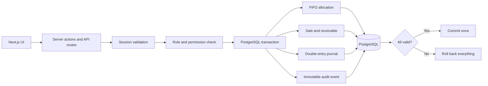
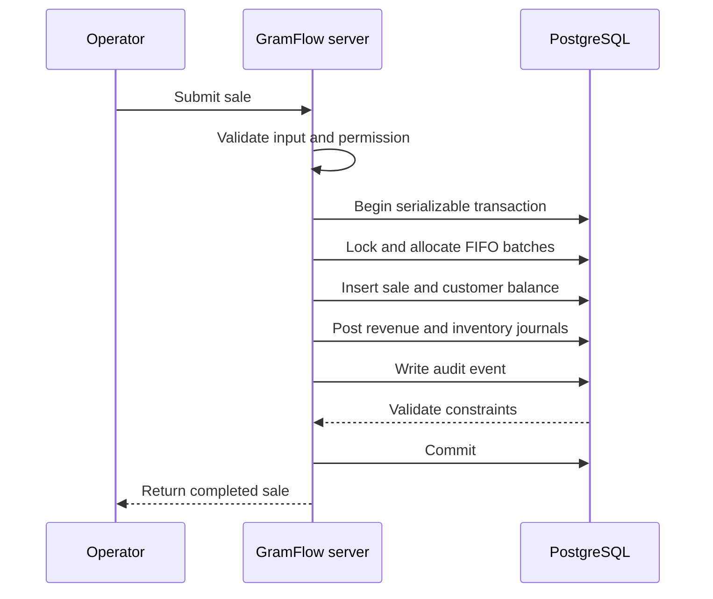

<div align="center">
  
  <h1>GramFlow</h1>
  <p><strong>The operations workspace for inventory, sales, receivables, and accounting.</strong></p>
  <p>Know what stock you have, what every sale earned, what customers owe, and what needs attention next.</p>

  <p>
    <a href="https://github.com/kashnordeen/GramFlow/releases/latest"></a>
    <a href="https://github.com/kashnordeen/GramFlow/actions/workflows/ci.yml"></a>
    
    
    
  </p>
</div>

---



GramFlow is a self-hosted business operations application for teams that buy stock in batches, sell by weight, manage customer balances, and need reliable financial records. It combines a responsive command-center interface with PostgreSQL-backed FIFO allocation, double-entry accounting, persisted permissions, and immutable audit history.

Everything that matters to a sale—stock consumption, customer receivables, journal entries, and the audit event—is committed in one database transaction. If any part fails, the whole operation rolls back.

## What GramFlow gives you

| Area | Capability |
| --- | --- |
| **Operations dashboard** | Live inventory, sales, realized profit, receivables, stock health, recent activity, and prioritized next actions. |
| **FIFO inventory** | Concurrency-safe allocation from the oldest eligible batch with exact batch lineage and reversal support. |
| **Sales** | Cash and credit sales, discounts, receipt generation, editing with financial adjustments, and full reversals. |
| **Customers** | Customer balances, payment history, outstanding receivables, and downloadable account reports. |
| **Accounting** | Balanced, immutable double-entry journals for sales, inventory cost, payments, adjustments, and reversals. |
| **Access control** | Database-backed roles and permissions enforced again on every protected server operation. |
| **Authentication** | Password login plus optional Google Workspace sign-in using authorization code, PKCE, state, and nonce validation. |
| **Auditability** | Append-only audit records written inside the same transaction as the business change. |
| **Privacy controls** | One-click masking of sensitive financial values throughout the workspace. |
| **Responsive workflow** | Desktop command palette, compact navigation, mobile navigation, light/dark themes, and accessible states. |

## Product tour

### One dashboard, truthful signals

The home workspace summarizes current stock, posted sales, gross profit, receivables, recent activity, and setup health. Trend calculations use posted transactions only. Realized margin includes the historical FIFO cost recorded at sale time; unsold inventory and reversed sales do not inflate profit.

### Stock received by batch, sold by FIFO

Operators record the weight and total cost of a stock receipt. GramFlow derives the precise unit cost internally, locks eligible PostgreSQL rows with `SELECT … FOR UPDATE`, consumes the oldest batch first, and stores the exact allocation used by every sale.

### Receivables stay connected to sales

Each sale records the amount received and the remaining balance. Later customer payments reduce receivables and post the corresponding accounting entry. Customer reports show the history without exposing authentication data.

### Accounting follows the operation

A posted sale can produce both revenue and cost-of-goods-sold journals. Journals must balance before insertion and are checked again by a deferred PostgreSQL constraint trigger at commit. Posted financial history cannot be edited or deleted; corrections use linked adjustment or reversal entries.

## Architecture



The browser never connects directly to PostgreSQL. Client-side permission checks improve the interface, but they are not trusted as a security boundary. Server actions and route handlers reload the current user, roles, and permissions before protected work begins.

### Sale transaction



## Technology

- Next.js 16 App Router and React 19
- TypeScript 5
- PostgreSQL 15 or newer
- `pg` connection pooling and explicit SQL transactions
- `jose` for signed sessions and Google identity verification
- `bcryptjs` with cost 12 for password hashing
- jsPDF for receipts and customer reports
- Node's built-in test runner through `tsx`

## Quick start

### Requirements

- Node.js 24 LTS
- npm
- PostgreSQL 15+ or Docker Desktop

Node.js 24 is required for the built-in SQLite importer.

### 1. Install and configure

```powershell
git clone https://github.com/kashnordeen/GramFlow.git
Set-Location GramFlow
npm install
Copy-Item .env.example .env
```

### 2. Start PostgreSQL

The quickest local option is Docker:

```powershell
docker compose up -d
```

This starts PostgreSQL at `localhost:5432` with the development credentials already shown in `.env.example`.

If you prefer an existing PostgreSQL server, create application and test databases owned by a non-superuser account, then update `DATABASE_URL` and `TEST_DATABASE_URL`.

### 3. Initialize the database

```powershell
npm run db:setup
```

The migration runner applies every unapplied file in `db/migrations`, stores its SHA-256 checksum, and refuses to continue if a previously applied migration has been modified. The seed is idempotent and creates the default permissions, roles, and chart of accounts.

### 4. Run GramFlow

```powershell
npm run dev
```

Open [http://localhost:3000](http://localhost:3000).

### 5. Create the first administrator

Open `/signup` and provide:

- an email under `ALLOWED_EMAIL_DOMAIN`
- a password with at least 10 characters, uppercase, lowercase, and numeric characters
- the private `REGISTRATION_CODE` from `.env`

The first account becomes `ADMIN`. The bootstrap route closes immediately afterward; additional users are created by an administrator from **Access control**.

## Configuration

| Variable | Required | Purpose |
| --- | --- | --- |
| `DATABASE_URL` | Yes | PostgreSQL connection string for the application database. |
| `TEST_DATABASE_URL` | For integration tests | Disposable PostgreSQL database; the suite creates an isolated schema inside it. |
| `DATABASE_SSL` | No | Set to `true` when the database host requires TLS. |
| `DB_POOL_MAX` | No | Maximum database connections. Defaults to `10`. |
| `JWT_SECRET` | Yes | Session and OAuth-flow signing secret with at least 32 characters. |
| `REGISTRATION_CODE` | Yes for bootstrap | Private code required to create the first administrator. |
| `ALLOWED_EMAIL_DOMAIN` | Yes | Exact organization domain allowed to authenticate. |
| `GOOGLE_CLIENT_ID` | No | Google OAuth web client ID. All three Google variables must be configured together. |
| `GOOGLE_CLIENT_SECRET` | No | Google OAuth web client secret. Keep it in a managed secret store in production. |
| `GOOGLE_REDIRECT_URI` | No | Exact callback URL ending in `/api/auth/google/callback`. HTTPS is required in production. |
| `SEED_ADMIN_EMAIL` | No | Optional development administrator created by `db:seed`. |
| `SEED_ADMIN_PASSWORD` | No | Password for the optional development administrator. |
| `SEED_ADMIN_NAME` | No | Display name for the optional development administrator. |
| `DEMO_SEED_PASSWORD` | No | Enables disposable demonstration fixtures. Never use in production. |
| `SQLITE_PATH` | For import only | Path read by the non-destructive SQLite importer. |

Never commit `.env`. The tracked `.env.example` contains placeholders and local development defaults only.

## Optional Google Workspace sign-in

1. Create a Google OAuth **Web application** client.
2. Add the application origin, such as `http://localhost:3000` during local development.
3. Register the exact callback URI: `http://localhost:3000/api/auth/google/callback`.
4. Set `GOOGLE_CLIENT_ID`, `GOOGLE_CLIENT_SECRET`, and `GOOGLE_REDIRECT_URI`.
5. Run `npm run db:migrate` and restart GramFlow.

Google signup is still limited to the first administrator and still requires `REGISTRATION_CODE`. After bootstrap, Google sign-in succeeds only for an existing active GramFlow account under `ALLOWED_EMAIL_DOMAIN`; it never creates an unexpected teammate. Existing password accounts can link a matching verified Google identity on first sign-in.

The flow uses authorization code plus PKCE, a signed 10-minute flow cookie, state and nonce validation, verified Google signatures, strict issuer and audience checks, verified email, and—when using a custom domain—the matching Workspace hosted-domain claim.

## Roles and permissions

| Default role | Intended access |
| --- | --- |
| `ADMIN` | Every permission, user administration, settings, and exports. |
| `MANAGER` | Sales, customers, inventory, pricing, and operational reporting. |
| `INVENTORY_OPERATOR` | Inventory reading, receiving, and updating. |
| `ACCOUNTANT` | Receivables, reports, journals, reversals, and audit history. |

Permissions are stored in PostgreSQL and reloaded on each protected request. Deactivating an account or changing its password invalidates existing sessions through the session-version mechanism.

## Inventory and costing

Stock receipts store:

- original quantity in grams
- remaining quantity
- total batch cost
- creation time and status

FIFO derives a six-decimal unit cost from the original batch total. Each sale allocation copies that historical unit cost into `sale_batch_assignments`, so later edits to the stock receipt cannot rewrite already-realized margin.

Reversing a sale restores the exact source batches while retaining the original sale, allocations, and linked opposite journals.

## Accounting model

The default chart of accounts includes:

| Code | Account | Type |
| --- | --- | --- |
| `1000` | Cash | Asset |
| `1010` | Bank | Asset |
| `1100` | Accounts Receivable | Asset |
| `1200` | Inventory | Asset |
| `3000` | Opening Balance Equity | Equity |
| `4000` | Sales Revenue | Revenue |
| `5000` | Cost of Goods Sold | Expense |
| `5100` | Inventory Loss | Expense |

For a ₹1,000 sale with ₹600 received and ₹350 of allocated inventory cost, GramFlow posts:

```text
Dr Cash                         ₹600
Dr Accounts Receivable         ₹400
    Cr Sales Revenue                 ₹1,000

Dr Cost of Goods Sold          ₹350
    Cr Inventory                      ₹350
```

A later ₹400 customer payment posts `Dr Cash / Cr Accounts Receivable`. Journal entries must contain at least two lines and equal debits and credits. PostgreSQL prevents updates, deletes, and truncation of posted financial history.

## Demo data

For a disposable local database, set `DEMO_SEED_PASSWORD` and run:

```powershell
npm run db:seed:demo
```

The command creates administrator, manager, inventory, and accountant users plus sample customers, stock, a credit sale, payment, journals, and audit events. It never runs during normal setup. Follow [`DEMO.md`](DEMO.md) for a five-minute walkthrough.

## Importing an older SQLite database

The importer opens the source database in read-only mode and never changes or deletes it.

1. Back up the SQLite database and any `-wal` file.
2. Stop the older application.
3. Initialize a fresh PostgreSQL target with `npm run db:setup`.
4. Set `SQLITE_PATH` to the source file.
5. Run `npm run db:import-sqlite`.
6. Review the printed source and target counts before starting GramFlow.

The importer preserves IDs, loads tables in foreign-key order, advances identity sequences, checks relationships, and validates row counts. `ON CONFLICT DO NOTHING` makes a retry safe; it is not intended to merge two live installations.

## Commands

| Command | Description |
| --- | --- |
| `npm run dev` | Start the development server on localhost. |
| `npm run dev:network` | Start development mode on all network interfaces. |
| `npm run build` | Create an optimized production build. |
| `npm start` | Run the production build. |
| `npm run lint` | Run ESLint. |
| `npm run typecheck` | Run TypeScript without emitting files. |
| `npm test` | Run unit, security, and PostgreSQL integration tests. |
| `npm run db:migrate` | Apply verified migrations in filename order. |
| `npm run db:seed` | Seed roles, permissions, accounts, and optional development admin. |
| `npm run db:setup` | Run migrations and the standard seed. |
| `npm run db:seed:demo` | Add optional local demonstration fixtures. |
| `npm run db:import-sqlite` | Import a legacy SQLite database into PostgreSQL. |

## Verification

```powershell
npm run lint
npm run typecheck
npm test
npm run build
npm audit --audit-level=high
```

The test suite covers accounting balance checks, persisted authorization, dashboard calculations, timestamp normalization, OAuth state and nonce validation, navigation filtering, FIFO allocation, insufficient-stock rollback, concurrent allocation, migration integrity, realized margin, immutable journals, immutable audit history, HTML escaping, email policy, password policy, and stock receipt validation.

GitHub Actions runs migrations, idempotent seeds, linting, type checking, the complete PostgreSQL suite, a production build, and a high-severity dependency audit on every pull request and push to `main`.

## Production deployment.

1. Provision PostgreSQL and a least-privilege application role.
2. Store database credentials, `JWT_SECRET`, registration code, and optional OAuth credentials in a managed secret store.
3. Set `DATABASE_SSL=true` when required by the provider.
4. Run `npm ci` and `npm run db:migrate` during deployment.
5. Run `npm run build`, then `npm start`.
6. Verify `/api/health`, authentication, a non-destructive read flow, and application logs.
7. Schedule encrypted PostgreSQL backups and test restoration regularly.

The admin-only `/api/backup` route creates a portable logical export without password hashes or authentication secrets. It is useful for portability, but it is not a replacement for operational `pg_dump` backups.

### Rollback

Application code can be rolled back to the previous release tag. Database migrations are forward-only and transactional, so inspect migration notes before deployment and restore from a tested database backup if a data-level rollback is required.

## Security model

- Passwords use bcrypt with cost 12.
- Sessions are signed JWTs containing only the user ID and session version.
- Session cookies are `httpOnly`, `SameSite=Lax`, and `Secure` in production.
- Five failed password logins within 15 minutes lock the email for 15 minutes.
- Every protected mutation checks the authenticated user's current database permissions.
- SQL uses parameterized queries.
- Sensitive operations write audit records inside their business transaction.
- Audit rows and posted journals are protected against update, delete, and truncate.
- Security headers include `X-Content-Type-Options`, `X-Frame-Options`, `Referrer-Policy`, and a restrictive `Permissions-Policy`.
- Production OAuth redirects must use HTTPS.

## Repository map

```text
app/                 Next.js pages, layouts, server routes, and workspace styling
components/          Shell, dashboard, authentication, and reusable UI components
db/migrations/       Ordered PostgreSQL schema migrations
db/seed.sql          Default roles, permissions, and accounting configuration
lib/actions/         Authorized business mutations
lib/auth/            Session, authorization, policy, and Google OAuth logic
lib/                 FIFO, accounting, dashboard, audit, reports, and database access
scripts/             Migration, seed, demo, and SQLite import tools
tests/               Unit, security, and PostgreSQL integration tests
public/              Brand and application assets
```

## Troubleshooting

### The app cannot connect to PostgreSQL

Confirm the database is running, the role can connect, and `DATABASE_URL` names the correct database. For Docker, check `docker compose ps` and wait until the health check is ready.

### Integration tests are skipped

Set `TEST_DATABASE_URL`. The connected role must be allowed to create and drop schemas. Never point the suite at a production database.

### Google sign-in says it is not configured

All three Google variables must be set. The configured redirect URI must exactly match the Google Cloud console entry and end with `/api/auth/google/callback`.

### Initial signup is closed

This is expected after the first user exists. Sign in as an administrator and create or manage teammates from `/admin/roles`.

### A migration checksum changed

Never edit an applied migration. Restore the original file and add a new migration for the next schema change.

## Release and upgrade notes

See [`CHANGELOG.md`](CHANGELOG.md) for user-facing release history. When upgrading from `v2.0.0` or earlier to the `v2.1` line, run `npm run db:migrate` before starting the new application. Migrations add Google identity support and convert legacy per-gram stock costs into whole-batch totals while preserving economic value.

---

<div align="center">
  <strong>GramFlow</strong><br />
  Inventory, receivables, and accounting—kept in one reliable flow.
</div>
