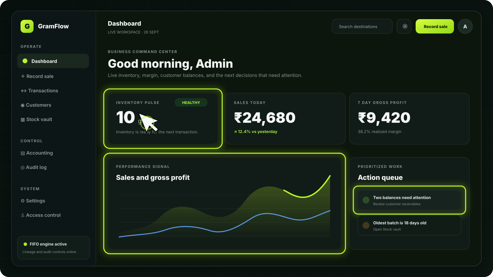

<div align="center">
  
  <h1>GramFlow</h1>
  <p><strong>The operations workspace for inventory, sales, receivables, and accounting.</strong></p>
  <p>Know what stock you have, what every sale earned, what customers owe, and what needs attention next.</p>

  <p>
    <a href="https://github.com/kashnordeen/GramFlow/releases/latest"></a>
    <a href="https://github.com/kashnordeen/GramFlow/actions/workflows/ci.yml"></a>
    
    
    
  </p>
</div>

---



GramFlow is a multi-business inventory, sales, and receivables app built with Next.js and PostgreSQL. Each business has its own stock, customers, gram rates, team, and accounting records. Sales allocate stock using FIFO and update the ledger and audit history in the same database transaction.

## Run locally

You need Node.js 24, npm, and PostgreSQL. Docker Compose can provide the local database.

```powershell
git clone https://github.com/kashnordeen/GramFlow.git
Set-Location GramFlow
npm ci
Copy-Item .env.example .env
docker compose up -d
```

The sample `DATABASE_URL` matches the Docker database. In `.env`, replace `JWT_SECRET` with a random value of at least 32 characters and set `GOOGLE_CLIENT_ID`, `GOOGLE_CLIENT_SECRET`, and `GOOGLE_REDIRECT_URI`. Create a Google OAuth web client with `http://localhost:3000` as an authorized origin and `http://localhost:3000/api/auth/google/callback` as an authorized redirect URI. The sample `ALLOWED_EMAIL_DOMAIN=gmail.com` permits verified Gmail accounts.

```powershell
npm run db:setup
npm run dev
```

Open [http://localhost:3000/signup](http://localhost:3000/signup) to create a business with Google. The owner names the business and sets its starting gram rate (initially ₹0), then can add custom weight ranges and workers. Worker login IDs are internal identifiers, not email inboxes.

## Checks

```powershell
npm run lint
npm run typecheck
npm test
npm run build
```

`npm test` includes PostgreSQL integration tests. Create the separate `gramflow_test` database named in `.env.example` (or point `TEST_DATABASE_URL` to another disposable database); never point it at production.

## Deploy

The app runs on Vercel with a PostgreSQL database such as Supabase. Set `DATABASE_URL`, `JWT_SECRET`, `ALLOWED_EMAIL_DOMAIN`, and the three `GOOGLE_*` variables in Vercel. For Supabase, use its transaction-pooler URL for the app, with `DATABASE_SSL=true` and `DB_POOL_MAX=1`. Run `npm run db:setup` from a trusted environment using the direct database URL before the first deployment; do not run migrations or seeds in the Vercel build.

Register the production URL ending in `/api/auth/google/callback` in Google Cloud and use that exact URL for `GOOGLE_REDIRECT_URI`. Keep credentials out of Git. On later schema upgrades, run `npm run db:migrate` before deploying code that depends on the new schema.

---

<div align="center">
  <strong>GramFlow</strong><br />
  Inventory, receivables, and accounting—kept in one reliable flow.
</div>
